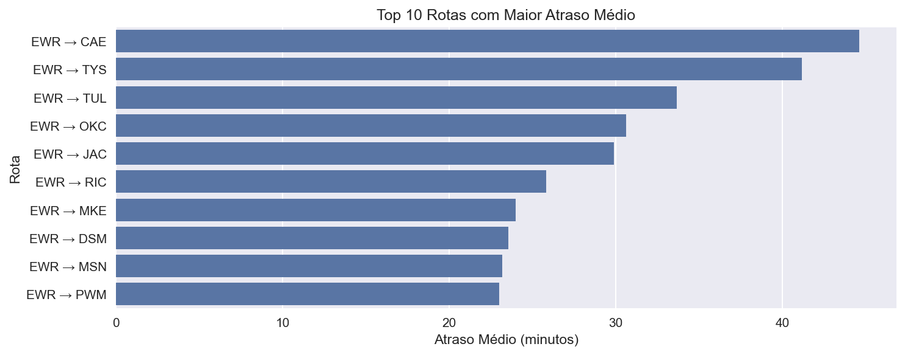
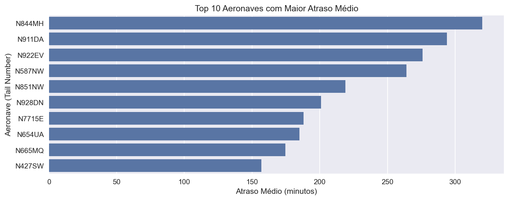
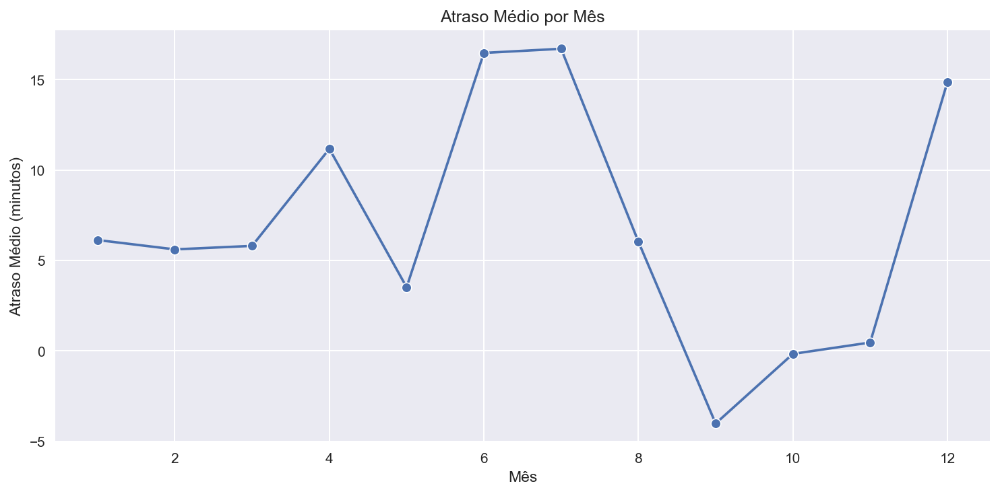
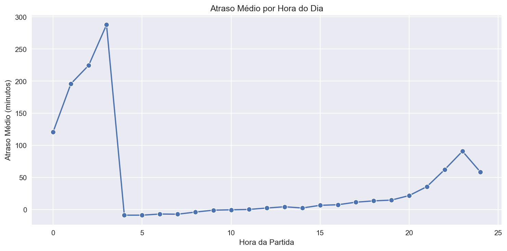
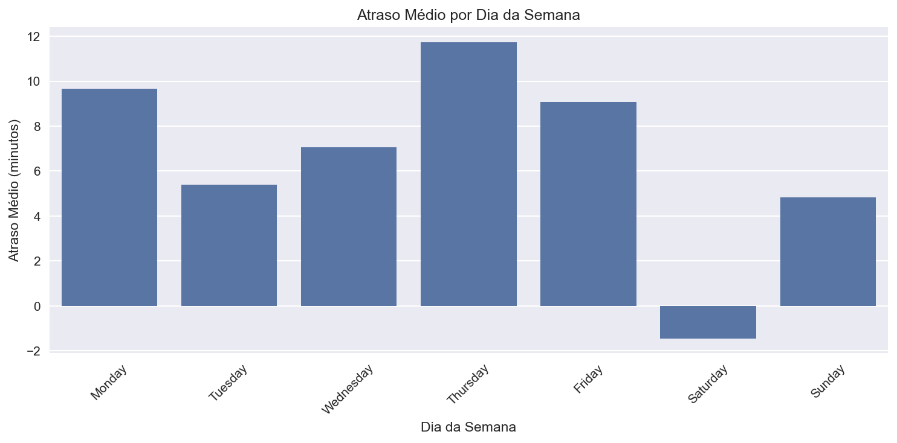

# ✈️ Análise Exploratória de Atrasos de Voos — NYC Flights

Este projeto apresenta uma **análise exploratória de dados (EDA)** sobre **atrasos de voos na cidade de Nova York**, utilizando a base de dados *NYC Flights*. O objetivo é identificar **padrões, causas e impactos operacionais dos atrasos**, apoiando a tomada de decisão no setor aéreo.

---

## 🎯 Objetivos da Análise

- Identificar **quais companhias aéreas mais registram atrasos**;
- Avaliar se a **rota e a aeronave influenciam nos atrasos**;
- Verificar se existem **padrões temporais** de atraso:
  - Por **mês**
  - Por **hora do dia**
  - Por **dia da semana**
- Propor **recomendações operacionais** para redução dos atrasos.

---

## 🗂️ Estrutura do Projeto

analise-atrasos-voos/
├── analyse_atrasos_voos.ipynb # Notebook com todas as análises e gráficos
├── dados_voo.xlsx # Base de dados utilizada
├── images/ # Imagens dos gráficos
│ ├── atraso_por_mes.png
│ ├── atraso_por_hora.png
│ ├── atraso_por_dia_semana.png
│ ├── rotas_maior_atraso.png
│ └── aeronaves_maior_atraso.png
└── README.md # Documentação do projeto


---

## 🛠️ Tecnologias Utilizadas

- **Python 3**
- **Pandas** – Manipulação de dados  
- **NumPy** – Cálculos numéricos  
- **Matplotlib & Seaborn** – Visualização de dados  
- **Jupyter Notebook** – Ambiente de análise  

---

## 📊 Principais Análises Realizadas

### ✅ 1. Companhias Aéreas
- Identificação das companhias com **maior percentual de voos atrasados**
- Análise quantitativa e qualitativa do desempenho operacional

---

### ✅ 2. Rotas e Aeronaves

#### 🔹 Top 10 Rotas com Maior Atraso Médio


- Forte concentração de atrasos em rotas com origem no aeroporto de **Newark (EWR)**.
- Indícios claros de impacto por **congestionamento aeroportuário**.

#### 🔹 Top 10 Aeronaves com Maior Atraso Médio


- Algumas aeronaves apresentam **histórico operacional recorrente de atrasos**.
- Indício de influência de **manutenção, programação e operação contínua**.

---

### ✅ 3. Padrões Temporais

#### 📅 Atraso Médio por Mês


- Evidência clara de **sazonalidade**, com picos em:
  - **Junho**
  - **Julho**
  - **Dezembro**

---

#### ⏰ Atraso Médio por Hora do Dia


- Atrasos mais elevados na **madrugada e início da manhã**.
- Crescimento gradual ao longo do dia caracteriza o **efeito cascata**.

---

#### 🗓️ Atraso Médio por Dia da Semana


- **Quinta-feira** apresenta o maior atraso médio.
- **Segunda e sexta** também apresentam altos índices.
- **Sábado** possui o melhor desempenho operacional.

---

## 📈 Resultados e Conclusões

- Os atrasos **não são aleatórios** e seguem padrões claros de:
  - Sazonalidade
  - Horários de pico
  - Dias úteis
- O aeroporto de **Newark (EWR)** concentra as rotas mais críticas.
- Algumas aeronaves apresentam **histórico recorrente de atrasos**.
- O **efeito cascata** foi confirmado ao longo do dia.

---

## ✅ Recomendações Operacionais

- Redistribuição de voos fora dos horários de pico;
- Reforço de equipes em meses críticos;
- Aumento do tempo de solo em voos críticos no início do dia;
- Monitoramento contínuo de rotas e aeronaves mais problemáticas.

---

## 📌 Como Executar o Projeto

1. Clone este repositório:

```bash
git clone https://github.com/DouglasSouza289/analise-atrasos-voos.git


